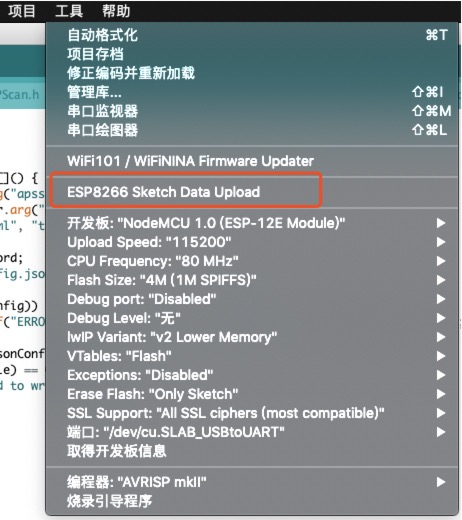

#  HackCube-Special

#  更新
> 1.增加自定义wifi的ssid和passwrod（通过读写config.json文件）
>
> 2.增加自定义中继wifi的ssid和passwrod（通过读写config.json文件）
>
> 3.增加自定义IP地址通过读写config.json文件）
>
> 4.删除原有内置gz的网页文件，改为data目录上传（可以直接修改web文件）
>
> 5.把wifi.html页面重新显示
>
> 6.修改esp8266调试接口为当前接口，通过工具->串口监视器，可以查看调试信息

## 安装方法

> 1.安装加载库ArduinoJson6.0以上版本（项目->加载库->管理库->搜索）
>
> 2.安装上传<你的Arduino目录>/tools/ESP8266FS/tool/esp8266fs.jar（注意：上传不可以和串口监视器一起用）
>
> 
> 
## 附加下载地址
> 1.arduino : https://www.arduino.cc/
>

## 参考
> 1.https://tttapa.github.io/ESP8266/Chap11%20-%20SPIFFS.html
>
> 2.文件上传 : https://github.com/esp8266/arduino-esp8266fs-plugin

##  使用
> 1.将HackCube Special 电源拨码打开。状态灯显示蓝色为正常
>
>  2.搜索并链接无线热点"HackCubeSpecial_XX:XX:XX",密码:"hackcube"
>
>  3.浏览器访问 http://192.168.5.1
> 

